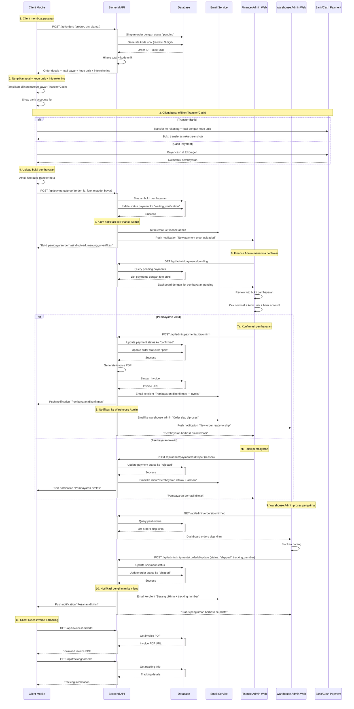

# Dokumentasi Sequence Diagram - Sistem E-Commerce Offline Payment

## 📋 Overview

Dokumen ini menjelaskan alur lengkap sistem e-commerce dengan pembayaran offline (transfer bank atau cash) yang melibatkan 3 komponen utama:

- **Client Mobile App** - Aplikasi mobile untuk customer
- **Finance Admin Web** - Dashboard web untuk admin keuangan
- **Warehouse Admin Web** - Dashboard web untuk admin gudang

---

## 🔄 Sequence Diagram



---

## 📝 Detail Penjelasan Setiap Proses

### **1. Client Membuat Pesanan**

**Aktor:** Client Mobile App  
**Tujuan:** Customer membuat pesanan barang

#### Proses Detail:

1. **User Interface:** Client memilih produk dari katalog, menentukan quantity, dan mengisi alamat pengiriman
2. **API Call:** `POST /api/orders` dengan payload:
   ```json
   {
     "products": [
       { "id": 1, "qty": 2 },
       { "id": 2, "qty": 1 }
     ],
     "shipping_address": "Jl. Merdeka No. 123, Jakarta",
     "notes": "Kirim pagi hari"
   }
   ```
3. **Database Operation:**
   - Sistem menyimpan order dengan status `"pending"`
   - Generate kode unik 3 digit (contoh: 237)
   - Hitung total: Harga produk + ongkir + kode unik
4. **Response:** Sistem mengembalikan detail order dengan info pembayaran

#### Output:

```json
{
  "order_id": "ORD-2025-001",
  "total_original": 150000,
  "unique_code": 237,
  "total_payment": 150237,
  "bank_accounts": [
    { "bank": "BCA", "number": "1234567890", "name": "Toko ABC" },
    { "bank": "Mandiri", "number": "0987654321", "name": "Toko ABC" }
  ]
}
```

---

### **2. Tampilkan Info Pembayaran**

**Aktor:** Client Mobile App  
**Tujuan:** Menampilkan instruksi pembayaran kepada customer

#### Proses Detail:

1. **UI Display:** App menampilkan halaman pembayaran dengan:
   - Total yang harus dibayar (termasuk kode unik)
   - Pilihan metode pembayaran (Transfer Bank / Cash)
   - Daftar rekening bank yang tersedia
   - Instruksi pembayaran yang jelas

#### Contoh UI:

```
💰 Total Pembayaran: Rp 150.237
   (Sudah termasuk kode unik: 237)

📋 Pilih Metode Pembayaran:
☐ Transfer Bank
☐ Bayar Cash

🏦 Transfer ke salah satu rekening:
• BCA: 1234567890 a.n. Toko ABC
• Mandiri: 0987654321 a.n. Toko ABC

⚠️ PENTING: Transfer sesuai nominal EXACT!
```

---

### **3. Client Melakukan Pembayaran Offline**

**Aktor:** Client (diluar aplikasi)  
**Tujuan:** Customer melakukan pembayaran secara offline

#### Skenario A: Transfer Bank

1. **Proses:** Customer membuka mobile banking atau pergi ke ATM
2. **Action:** Transfer ke rekening tujuan dengan nominal EXACT (Rp 150.237)
3. **Output:** Customer mendapat bukti transfer (screenshot/struk)

#### Skenario B: Cash Payment

1. **Proses:** Customer datang ke toko fisik atau agen pembayaran
2. **Action:** Bayar cash sesuai nominal ke kasir/agen
3. **Output:** Customer mendapat nota/struk pembayaran

#### Validasi Kode Unik:

- **Transfer:** Sistem nanti akan cocokkan nominal masuk dengan kode unik
- **Cash:** Kasir/agen yang validasi nominal dan berikan nota

---

### **4. Upload Bukti Pembayaran**

**Aktor:** Client Mobile App  
**Tujuan:** Customer mengupload foto bukti pembayaran

#### Proses Detail:

1. **Camera Integration:**
   - Buka kamera untuk foto bukti transfer/nota
   - Auto-crop dan compress image (max 2MB)
   - Preview sebelum upload
2. **API Call:** `POST /api/payments/proof` dengan payload:
   ```json
   {
     "order_id": "ORD-2025-001",
     "payment_method": "transfer", // atau "cash"
     "bank_account": "BCA - 1234567890",
     "image": "base64_encoded_image",
     "notes": "Transfer via mobile banking"
   }
   ```
3. **Database Operation:**
   - Simpan foto bukti ke cloud storage
   - Update payment status ke `"waiting_verification"`
   - Catat timestamp upload

#### Validasi Upload:

- Format file: JPG, PNG only
- Size maksimal: 2MB
- Dimension minimal: 300x300px

---

### **5. Notifikasi ke Finance Admin**

**Aktor:** Backend System  
**Tujuan:** Memberitahu admin finance ada pembayaran baru yang perlu diverifikasi

#### Proses Detail:

1. **Email Notification:**

   ```
   Subject: [URGENT] Bukti Pembayaran Baru - Order #ORD-2025-001

   Ada bukti pembayaran baru yang perlu diverifikasi:
   - Order ID: ORD-2025-001
   - Customer: John Doe
   - Nominal: Rp 150.237
   - Metode: Transfer BCA
   - Waktu Upload: 29 Jul 2025, 14:30

   Silakan login ke dashboard untuk verifikasi.
   ```

2. **Push Notification ke Web Dashboard:**

   - Real-time notification menggunakan WebSocket
   - Sound alert untuk menarik perhatian
   - Badge counter di menu "Pending Payments"

3. **Response ke Client:**
   - Konfirmasi upload berhasil
   - Estimasi waktu verifikasi (misal: 1-3 jam kerja)

---

### **6. Finance Admin Verifikasi**

**Aktor:** Finance Admin Web  
**Tujuan:** Admin memverifikasi kebenaran bukti pembayaran

#### Proses Detail:

1. **Dashboard Access:** Admin buka halaman "Pending Payments"
2. **API Call:** `GET /api/admin/payments/pending` untuk list semua pembayaran pending
3. **Review Process:**
   - Klik foto bukti untuk melihat detail dengan fitur zoom
   - Cross-check nominal transfer dengan total + kode unik
   - Validasi rekening tujuan sesuai
   - Cek timestamp transfer vs timestamp order

#### UI Dashboard Finance:

```
📋 Pembayaran Pending Verifikasi

┌─────────────────────────────────────────────────┐
│ Order: ORD-2025-001 | Customer: John Doe       │
│ Total: Rp 150.237 | Method: Transfer BCA       │
│ Upload: 29 Jul 2025, 14:30                     │
│                                                │
│ [📷 View Proof] [✅ Approve] [❌ Reject]        │
└─────────────────────────────────────────────────┘
```

#### Kriteria Verifikasi:

- ✅ Nominal transfer sesuai (termasuk kode unik)
- ✅ Rekening tujuan benar
- ✅ Timestamp transfer masuk akal
- ✅ Foto bukti jelas dan tidak blur
- ✅ Tidak ada tanda-tanda manipulasi

---

### **7a. Konfirmasi Pembayaran (Approve)**

**Aktor:** Finance Admin Web  
**Tujuan:** Menyetujui pembayaran yang valid

#### Proses Detail:

1. **API Call:** `POST /api/admin/payments/{id}/confirm`
2. **Database Updates:**
   - Payment status: `"waiting_verification"` → `"confirmed"`
   - Order status: `"pending"` → `"paid"`
   - Catat admin yang approve dan timestamp
3. **Invoice Generation:**
   - Auto-generate PDF invoice dengan format profesional
   - Include detail produk, alamat, metode pembayaran
   - Simpan di cloud storage dan database
4. **Multi-Channel Notifications:**
   - **Email ke Client:** "Pembayaran Dikonfirmasi + Invoice terlampir"
   - **Push ke Mobile:** "Pembayaran Anda telah dikonfirmasi!"
   - **Email ke Warehouse:** "Order siap diproses - ORD-2025-001"
   - **Push ke Warehouse Dashboard:** Real-time notification

#### Template Email ke Client:

```
Subject: ✅ Pembayaran Dikonfirmasi - Order #ORD-2025-001

Halo John Doe,

Pembayaran Anda telah dikonfirmasi!

Detail Pembayaran:
- Order ID: ORD-2025-001
- Nominal: Rp 150.237
- Metode: Transfer BCA
- Dikonfirmasi: 29 Jul 2025, 15:00

Invoice digital terlampir dalam email ini.
Pesanan Anda sedang diproses oleh tim gudang.

Terima kasih!
```

---

### **7b. Tolak Pembayaran (Reject)**

**Aktor:** Finance Admin Web  
**Tujuan:** Menolak pembayaran yang tidak valid

#### Proses Detail:

1. **API Call:** `POST /api/admin/payments/{id}/reject` dengan alasan penolakan
2. **Database Updates:**
   - Payment status: `"waiting_verification"` → `"rejected"`
   - Catat alasan penolakan dan admin yang reject
3. **Notification ke Client:**
   - **Email:** Pembayaran ditolak dengan alasan detail
   - **Push:** "Pembayaran ditolak, silakan upload ulang"

#### Alasan Penolakan Umum:

- Nominal transfer tidak sesuai
- Rekening tujuan salah
- Foto bukti tidak jelas/blur
- Bukti transfer palsu/manipulasi
- Transfer dari rekening yang berbeda nama

#### Template Email Penolakan:

```
Subject: ❌ Pembayaran Ditolak - Order #ORD-2025-001

Halo John Doe,

Mohon maaf, pembayaran Anda ditolak karena:
"Nominal transfer tidak sesuai. Harap transfer Rp 150.237"

Silakan:
1. Transfer ulang dengan nominal yang benar
2. Upload ulang bukti pembayaran
3. Atau hubungi customer service untuk bantuan

Order Anda masih aktif selama 24 jam.
```

---

### **8. Notifikasi ke Warehouse Admin**

**Aktor:** Backend System  
**Tujuan:** Memberitahu warehouse admin ada order siap diproses

#### Proses Detail:

1. **Trigger:** Otomatis setelah finance admin approve pembayaran
2. **Email Notification ke Warehouse:**

   ```
   Subject: 📦 Order Siap Diproses - #ORD-2025-001

   Order baru siap untuk diproses:
   - Order ID: ORD-2025-001
   - Customer: John Doe
   - Products: Product A (2x), Product B (1x)
   - Alamat: Jl. Merdeka No. 123, Jakarta
   - Priority: Normal

   Silakan login ke dashboard untuk memproses.
   ```

3. **Real-time Dashboard Notification:**
   - Badge counter di menu "Ready to Ship"
   - Sound alert untuk warehouse staff
   - Highlight order baru dengan warna berbeda

---

### **9. Warehouse Admin Proses Pengiriman**

**Aktor:** Warehouse Admin Web  
**Tujuan:** Memproses dan mengirim barang pesanan

#### Proses Detail:

1. **Dashboard Access:** Admin buka halaman "Orders Ready to Ship"
2. **API Call:** `GET /api/admin/orders/confirmed` untuk list order yang sudah dibayar
3. **Physical Process:**
   - Pick & pack barang sesuai order
   - Siapkan label pengiriman
   - Serahkan ke kurir dan dapatkan resi
4. **System Update:** `POST /api/admin/shipments/{orderId}/update` dengan:
   ```json
   {
     "status": "shipped",
     "tracking_number": "JNE123456789",
     "courier": "JNE",
     "estimated_delivery": "2025-07-31",
     "notes": "Dikirim via JNE REG"
   }
   ```

#### UI Dashboard Warehouse:

```
📦 Orders Ready to Ship

┌─────────────────────────────────────────────────┐
│ Order: ORD-2025-001 | Customer: John Doe       │
│ Products: Product A (2x), Product B (1x)       │
│ Address: Jl. Merdeka No. 123, Jakarta          │
│                                                │
│ Tracking: [_____________] Courier: [JNE ▼]     │
│ [📦 Mark as Shipped]                           │
└─────────────────────────────────────────────────┘
```

#### Database Updates:

- Shipment status: `"preparing"` → `"shipped"`
- Order status: `"paid"` → `"shipped"`
- Inventory: Kurangi stok produk yang dikirim

---

### **10. Notifikasi Pengiriman ke Client**

**Aktor:** Backend System  
**Tujuan:** Memberitahu customer bahwa barang sudah dikirim

#### Proses Detail:

1. **Multi-Channel Notifications:**
   - **Email:** Detail pengiriman + tracking number
   - **Push Mobile:** "Pesanan Anda sudah dikirim!"
   - **SMS** (optional): Tracking number untuk kemudahan

#### Template Email Pengiriman:

```
Subject: 🚚 Pesanan Dikirim - Order #ORD-2025-001

Halo John Doe,

Kabar baik! Pesanan Anda sudah dikirim.

Detail Pengiriman:
- Order ID: ORD-2025-001
- Kurir: JNE Regular
- No. Resi: JNE123456789
- Estimasi Tiba: 31 Juli 2025
- Status: Dalam Perjalanan

Tracking: https://app.example.com/tracking/ORD-2025-001

Terima kasih atas kepercayaan Anda!
```

#### Push Notification Mobile:

```json
{
  "title": "Pesanan Dikirim! 🚚",
  "body": "Order #ORD-2025-001 sedang dalam perjalanan",
  "data": {
    "order_id": "ORD-2025-001",
    "action": "open_tracking"
  }
}
```

---

### **11. Client Akses Invoice & Tracking**

**Aktor:** Client Mobile App  
**Tujuan:** Customer mengakses invoice dan melacak pengiriman

#### Proses Detail A: Download Invoice

1. **API Call:** `GET /api/invoices/{orderId}`
2. **Response:** URL download PDF invoice dari cloud storage
3. **UI Action:**
   - Download PDF ke device
   - Buka PDF viewer dalam app
   - Option share via WhatsApp/email

#### Proses Detail B: Tracking Pengiriman

1. **API Call:** `GET /api/tracking/{orderId}`
2. **Database Query:**
   - Ambil data shipment dari database internal
   - (Optional) Sync dengan API kurir eksternal untuk update real-time
3. **Response Format:**
   ```json
   {
     "order_id": "ORD-2025-001",
     "tracking_number": "JNE123456789",
     "courier": "JNE",
     "current_status": "in_transit",
     "estimated_delivery": "2025-07-31",
     "tracking_history": [
       {
         "status": "picked_up",
         "description": "Paket sudah diambil kurir",
         "timestamp": "2025-07-29T16:00:00Z",
         "location": "Jakarta Pusat"
       },
       {
         "status": "in_transit",
         "description": "Paket dalam perjalanan",
         "timestamp": "2025-07-30T08:00:00Z",
         "location": "Sorting Center Jakarta"
       }
     ]
   }
   ```

#### Mobile UI Tracking:

```
📋 Status Pengiriman

Order: ORD-2025-001
Resi: JNE123456789

🚚 Status: Dalam Perjalanan
📅 Estimasi: 31 Juli 2025

Timeline:
✅ 29 Jul, 16:00 - Paket diambil kurir
✅ 30 Jul, 08:00 - Sorting Center Jakarta
🔄 30 Jul, 14:00 - Dalam perjalanan
⏳ 31 Jul - Estimasi tiba

[📱 Hubungi Kurir] [📧 Download Invoice]
```

---

## 📊 Status Flow Summary

### Order Status Flow:

```
pending → paid → shipped → delivered
```

### Payment Status Flow:

```
waiting_verification → confirmed/rejected
```

### Shipment Status Flow:

```
preparing → shipped → in_transit → delivered
```

---

## 🔧 Technical Implementation Notes

### Database Indexes yang Diperlukan:

- `orders.status` + `orders.created_at` (untuk query dashboard)
- `payments.status` + `payments.created_at` (untuk verifikasi pending)
- `users.email` (untuk notifikasi email)

### File Storage Structure:

```
/uploads/
  /payment-proofs/
    /2025/07/29/
      order-123-proof-timestamp.jpg
  /invoices/
    /2025/07/29/
      invoice-ORD-2025-001.pdf
```

### API Rate Limiting:

- Upload bukti: 5 requests/minute/user
- Email notifications: 100 emails/hour
- Push notifications: 1000 push/hour

### Security Considerations:

- JWT token untuk autentikasi
- File upload validation (type, size, malware scan)
- Input sanitization untuk semua form
- HTTPS untuk semua komunikasi
- Database encryption untuk data sensitif

---

## 🚀 Monitoring & Analytics

### Metrics yang Perlu Ditrack:

1. **Conversion Rate:** Order → Payment → Delivery
2. **Verification Time:** Rata-rata waktu admin verify payment
3. **Payment Success Rate:** Approved vs Rejected ratio
4. **Processing Time:** Order → Shipped duration
5. **Customer Satisfaction:** Delivery time vs estimation

### Alerts yang Perlu Disetup:

- Payment pending > 4 jam (untuk SLA)
- Order paid tapi belum shipped > 24 jam
- High rejection rate pembayaran (> 20%)
- Server error rate > 5%
- Email delivery failure

---

Dokumentasi ini memberikan panduan lengkap untuk implementasi sistem e-commerce dengan pembayaran offline. Setiap proses sudah dijelaskan secara detail dari sisi teknis, UI/UX, dan business logic.
